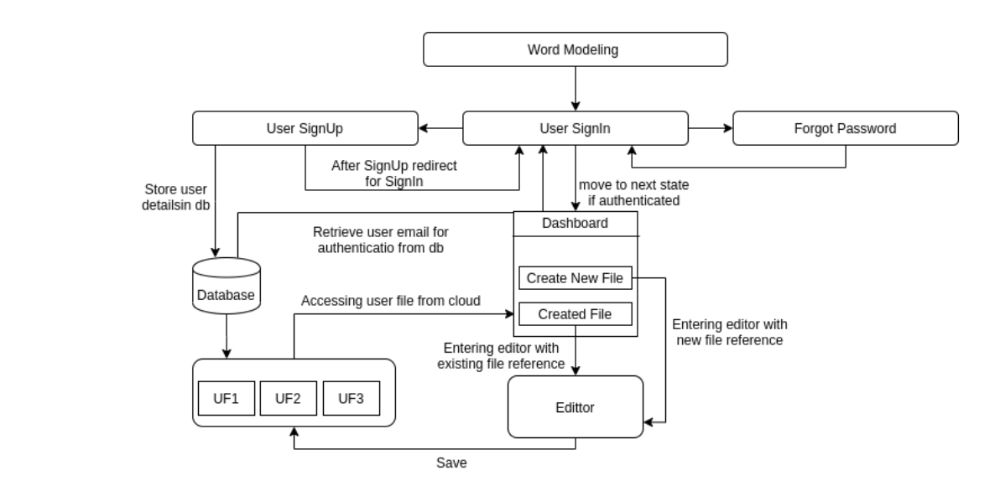

# Kannada Language Modeling

[]()


A kannada word predictor platform which uses **Tensorflow Keras** backend powered by **flask** microframework. 
 
This project is made interactive by jquery and sends asyncronous requests for more interactive and personalized experience.

This project is based on the Word modeling/language modeling technique for  **kannada**  (kn) language which pridicts the next words for the language input integrated to flask miroframework.

**Language modeling** is the task of assigning a probability to sentences in a language. Besides assigning a probability to each sequence of words, the language models also assigns a probability for the likelihood of a given word (or a sequence of words) to follow a sequence of words.

This project code can work for any Indian Scheduled Language and unicode languages.

## Installation

The given below command can be used to install all the packages required to run the application.Enter the following command in the Powershell/Terminal.


    $ pip install -r requirements.txt

> **Note:** The above command assumes that  **pip** is installed in the machine to create the virtual environment. Regardless any environment, The packages specified in the **requirements.txt** file need to be installed.


### To enable email verification, The following steps need to be performed :

**Step 1:** 

Sign into the Gmail account using a web browser at [https://mail.google.com](https://mail.google.com/), then go to Settings > Accounts and Import > Other Google Account settings. Under Security, scroll down and enable access for less secure apps. This setting is required to enable SMTP, POP or IMAP access.

**Step 2:** 

Type the following commands in the Powershell/Terminal
 

     $ export mail=**your email**
     $ export password=**your password**

The above commands uses the given gmail id to send account verification,password verification etc. Since the current smtp server is only configured to google. **only gmail accounts** can be used to send actvation links currently.

### To run the flask server  :

To run the flask server, The following Commands must be typed in the Terminal/Powershell.

```
$ export FLASK_APP=run.py
$ flask run
```
Now, open your Web-Browser and type-in
```
http://127.0.0.1:5000/
```
## Alternate Method:Running server using Bash script (Experimental)

Alternatively, A bash script is written to automate email export i.e., step 2 and to run the flask server. Execute this script only after **pip**  is installed.

#### Steps to execute the bash script:

-   `sudo apt-get install jq`(if previously not installed.)
-   `chmod +x run.sh`
-   `./run.sh`

_**NOTE:**_

-   The written bash scirpt is to be executed only after  **pip**  is installed otherwise, The script may not work.
-   This script only works for pip virtutal environment and not any other virtual environment.


# Project Description :

### Abstract of the Project : 

This project proposes a novel methodology to predict the next word in a Kannada(kn) sentence. By predicting the next word in a sequence, the number of keystrokes of the user can be reduced. Two deep learning techniques namely Long Short Term Memory (LSTM) has been explored for the task of predicting next word. A Long Short Term Memory network (LSTM) model which is a special kind of Recurrent Neural Network (RNN) for instant messaging, where the goal is to predict next word(s) given a set of current words to the user. 

This method is more complex in other languages apart from English. For instance, in Kannada language, there are some equivalent synonyms of the word ‘you’, that is used to address a second person in English. Here, we have developed a solution to this issue by storing the transcripted Kannada language according to International Phonetic Association(IPA) chart and have fed the data into our model.


###  System Architecture :

The following discribes the system architecture of the project :



## License

This Project is licenced under  [MIT License.](LICENSE)

## Project Contributors

-   [Tejasvi S](https://github.com/kushtej)
